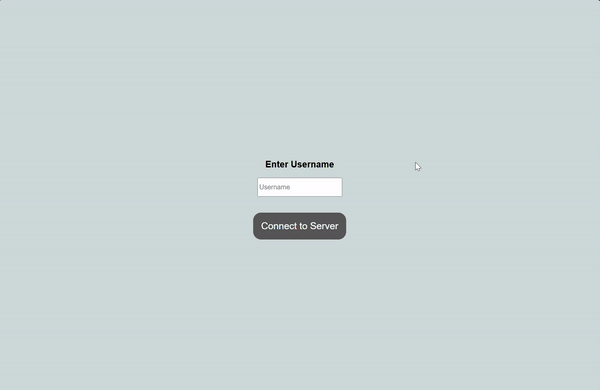

# Socket.io Examples

The purpose of this repo is so offer some examples of how to use Socket.io in a full-stack application to establish stateful real-time communication. This repo contains two examples of different difficulties utilizing the same tech stack.

## Tech Stack
- **Client:** React + Vite + TS
- **Server:** Express + Socket.io

## Simple Example
The simple example is a application where the client shows different inspirational quotes that it gets sent from the server. The quotes are not generated or stored in the frontend, but are emitted through the socket connection every five seconds.

## Intermediate Example
The intermediate exmaple is a chatroom like application where the user first has to give a username and then connect to the server. Once connected, they can join chatrooms and chat with whoever else is connected to them. To fully test this example, open the client on two different browsers and chat in the same room.

## Get Started
Here are the steps to run either of the examples:

#### Server
1) Navigate into the directory of whichever example you want to run.
2) In one terminal, navigate into the `server` directory and run `npm i` to install all dependencies.
3) *Optional* - If you want the server to run on a specific port, create a `.env` file following the format of the `.env.example` file and include the port number there. By default the server will run on port 3000.
4) Run `npm run dev` to start the server in development mode.

#### Client
1) Navigate into the directory of whichever example you want to run.
2) In a terminal, navigate into the `client` directory and run `npm i` to install all dependencies.
3) *Optional* - If you have given a specified port for the server, create a `.env` file following the format of the `.env.example` file and include the server URL there. By default the server URL will be `http://localhost:3000`.
4) Run `npm run dev` to start the client in development mode.
5) On a browser, navigate to `http://localhost:5173` or wherever your client is running.
